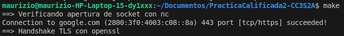
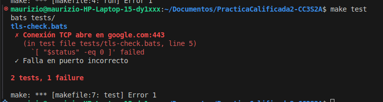

# Bitácora Sprint 2

## Comandos ejecutados

### Verificar socket y Handshake TLS

Con el comando `make run` se verifican socket y Handshake TLS con openssl



## Ejecución de pruebas
```
$ make test
```



## Commits realizados
```
* 83ea944 Registrar en bitácora Sprint 2 las evidencias de socket y handshake TLS
* 5b04e1a Añadir pruebas Bats para verificar conexión TCP y fallo en puerto incorrecto
* 107b0f5 Agregar script tls-check.sh para verificar socket y handshake TLS
* 4a1c23d Definir Makefile con targets run, test y clean
```

## Decisiones
- Se usó `nc` para verificar apertura de socket.
- Se usó `openssl s_client` para observar el protocolo TLS.
- Se añadieron pruebas automáticas positivas y negativas con Bats.
- Se definió un Makefile mínimo para correr script, pruebas y limpieza.
